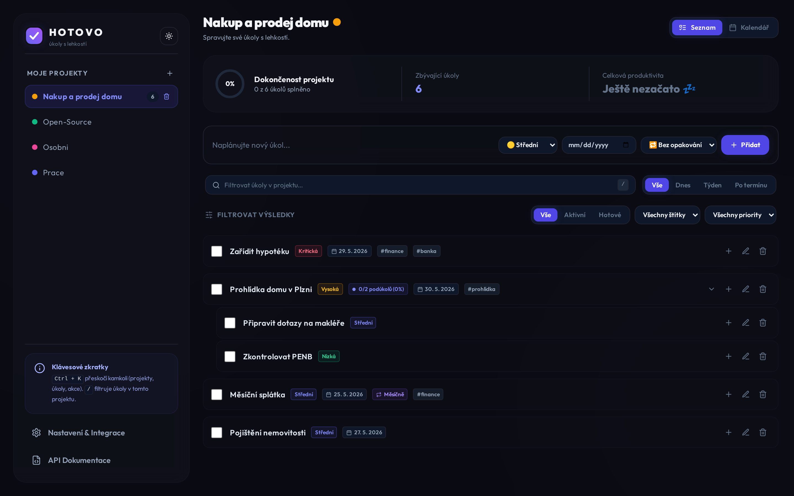
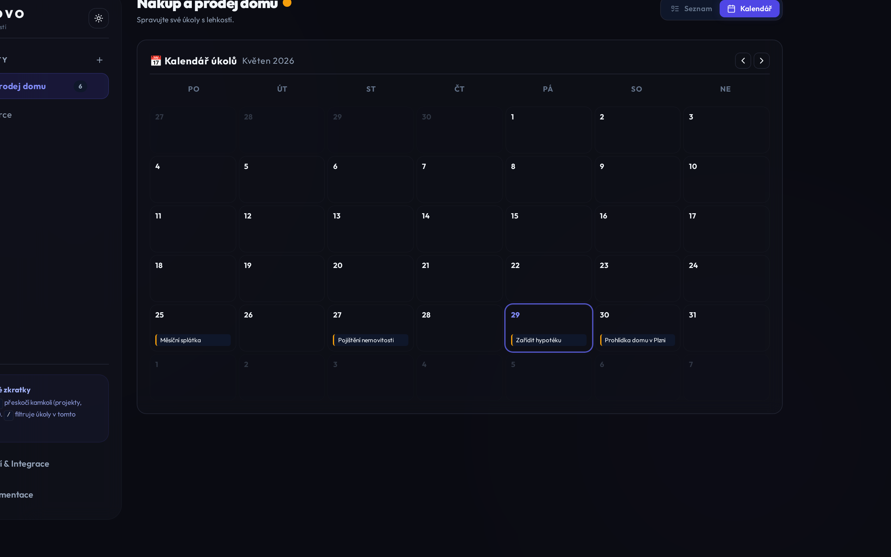
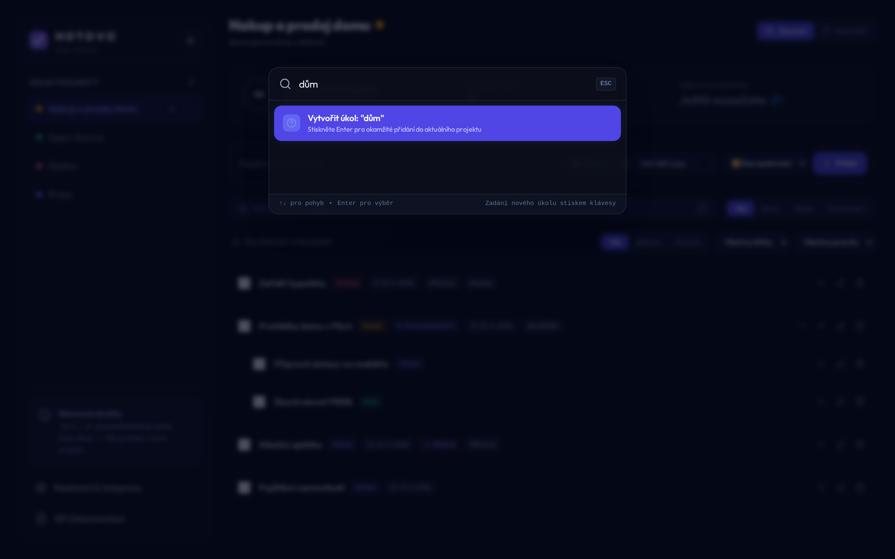
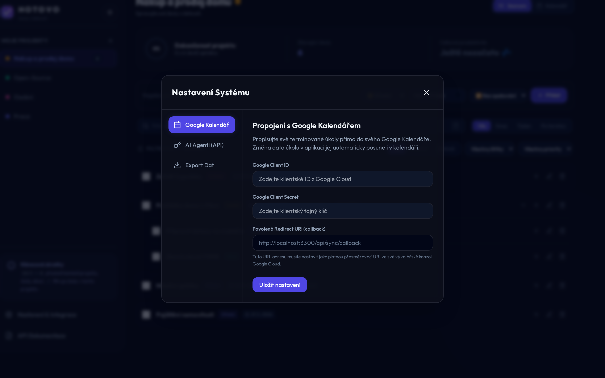

# HOTOVO ✓

**HOTOVO** je moderní, sebehostovatelná aplikace na správu úkolů pro **Raspberry Pi 4** (a jiná zařízení s nízkou spotřebou RAM). Má vestavěné **REST API pro AI agenty** (OpenAPI + MCP server) a obousměrnou integraci s **Google Kalendářem**.

> Název říká vše: *HOTOVO* — to slovo, co řekneš, když je úkol odškrtnutý. ✓



<p align="center">
  
  
</p>
<p align="center">
  
</p>

---

## 🎨 Vlastnosti
- **Čisté 2026 UI:** tmavé rozhraní s jemným glass efektem, plynulé animace, písmo *Outfit*, vlastní logo.
- **Hierarchické úkoly:** vnořené podúkoly s automatickým rollupem stavu (dokončením všech podúkolů se dokončí rodič a naopak).
- **Opakované úkoly:** denně / týdně / měsíčně — odškrtnutím se úkol posune na další termín (styl Todoist).
- **Štítky a hledání:** tagy napříč projekty, fulltext a rychlé filtry **Dnes / Tento týden / Po termínu**.
- **Kalendář:** měsíční přehled úkolů s rychlým plánováním.
- **Command Palette (Ctrl/Cmd + K):** skoč kamkoli; `/` filtruje úkoly v projektu.
- **API pro AI agenty:** zabezpečené REST API + **MCP server**, ať agenti (custom GPTs, Gemini/Gemma) spolehlivě plánují a upravují úkoly.
- **Google Calendar Sync:** robustní synchronizace přes durable outbox (idempotentní, s retry).
- **Export dat:** JSON, Markdown, CSV.

---

## 🏗️ Architektura
- **Backend:** Node.js (Express, ES modules), SQLite (WAL). Jediný proces, < 70 MB RAM.
- **Frontend:** React (Vite), Tailwind CSS, Framer Motion, Lucide.
- **Produkce:** frontend se zkompiluje do statických souborů a Express je servíruje na portu `3000`.

---

## 🚀 Spuštění (lokálně)

```bash
# 1. Závislosti (Arch: ./scripts/install-arch.sh; jinak ručně)
npm run install:all

# 2a. Vývoj — API :3000 + Vite :5173 (proxy, hot reload)
npm run dev            # → http://localhost:5173

# 2b. Produkce — sjednocený server na :3000
./scripts/start-app.sh # build frontendu + NODE_ENV=production npm start
```

Konfigurace přes `.env` (viz [`.env.example`](.env.example)): `PORT`, `HOST`, `NODE_ENV`, `DB_PATH`, `TODO_SECRET_KEY`, `CORS_ORIGINS`, `LOCAL_UI_BYPASS`, `PUBLIC_BASE_URL`.

### Nasazení na Raspberry Pi / server
Viz [`deploy/README.md`](deploy/README.md) — nginx (SSL reverse proxy), systemd unit, `deploy/install-pi.sh` (první instalace) a `scripts/deploy-pi.sh` (aktualizace).

---

## 🤖 API pro AI agenty

Lokální UI na stejném zařízení (loopback, stejný origin) token nepotřebuje. **Nelokální** klienti posílají:

```
Authorization: Bearer <váš_token>
```

Token vytvoříš v **Nastavení → AI Agenti (API)**. Tokeny se ukládají jen jako hash (SHA‑256) — surovou hodnotu uvidíš jen jednou. Při prvním startu se výchozí token zapíše do `INITIAL_TOKEN.txt` (práva 0600) — zkopíruj a smaž.

### Nejrychlejší start pro agenta
- `GET /api/agent/guide` — stručný návod v Markdownu přímo do system promptu (i pro malé modely jako Gemma).
- `GET /api/agent/state` — snapshot všech projektů a úkolů jedním voláním.
- `GET /api/docs` — přehledová stránka, `GET /api/docs/openapi.json` — OpenAPI 3.1.

### MCP server (Model Context Protocol)
Pro agenty mluvící MCP je k dispozici stdio server (tenká vrstva nad API, znovu používá veškerou validaci a synchronizaci):

```bash
# HOTOVO server musí běžet; pak agenta nasměruj na:
npm run mcp           # = node server/mcp.js
# nelokální/zabezpečený provoz: HOTOVO_API_TOKEN=<token> npm run mcp
```

Nástroje: `get_state`, `list_projects`, `create_project`, `list_tasks`, `create_task`, `update_task`, `complete_task`, `delete_task`. Stručný návod pro agenta: [`docs/MCP.md`](docs/MCP.md).

### Hlavní endpointy
- `GET /api/tasks` — výpis (filtry `list_id`, `status`, `priority`, `due_date`, `search`, `tag`, `due=today|week|overdue`)
- `POST /api/tasks` — vytvořit úkol/podúkol (`parent_id` = podúkol, musí být ve stejném projektu); pole `recurrence`, `tags`
- `PUT /api/tasks/:id` — upravit / dokončit
- `DELETE /api/tasks/:id` — smazat (s podúkoly `?confirm=true`)
- `GET /api/lists` · `POST /api/lists` · `DELETE /api/lists/:id?confirm=true`
- `GET /api/tokens/export-data?format=markdown|json|csv`

---

## 🔒 Bezpečnost (přehled)
- **Fail‑closed auth**, hashované tokeny, žádný zadrátovaný výchozí token.
- Server se váže na `127.0.0.1`; pro LAN nastav `HOST=0.0.0.0` až po vytvoření tokenů.
- Za reverzní proxy nastav `LOCAL_UI_BYPASS=false` (lokální bypass se navíc sám vypne při forwarded hlavičkách).
- Citlivé údaje (OAuth) šifrované at‑rest; pro silnější ochranu nastav `TODO_SECRET_KEY`.
- Bezpečnostní hlavičky (anti‑clickjacking), parametrizované SQL, ošetřený CSV/Markdown export.

---

## 📅 Google Calendar Sync
1. [Google Cloud Console](https://console.cloud.google.com/) → nový projekt → povol **Google Calendar API**.
2. **OAuth consent screen**: typ *External*, přidej svůj e‑mail mezi testovací uživatele.
3. **Credentials** → vytvoř **OAuth client ID** (Webová aplikace).
4. **Authorized redirect URI**: `http://localhost:3000/api/sync/callback` (popř. `https://<tvá-doména>/api/sync/callback`).
5. V appce **Nastavení → Google Kalendář** zadej Client ID + Secret, ulož a připoj účet.

---

## 🧪 Testy
```bash
npm run test:backend   # node:test API integrační testy
npm run test:e2e       # Playwright e2e (izolovaný port + čistá test DB)
```

## 📄 Licence
MIT (viz [LICENSE](LICENSE)).
